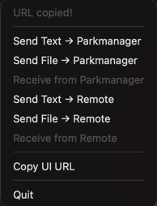
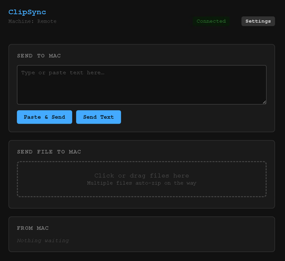

# ClipSync

> Cross-machine clipboard relay for when your corporate RDP won't let you copy-paste.

You work on a Mac. You RDP into a customer's Windows machine through Horizon, AnyDesk, Jump Desktop, or similar — and the clipboard is one-way, text-only, or disabled entirely. Sending text and files back and forth becomes "email yourself" hell. ClipSync fixes that.

Common offenders:

- **Omnissa / VMware Horizon** — admins routinely disable clipboard back to the client
- **Jump Desktop (Fluid protocol)** — fast, but the Fluid clipboard is **text-only**; files don't cross
- **AnyDesk / TeamViewer corporate policies** — often locked to one direction
- **Browser-based RDP / Citrix HTML5** — no clipboard support at all

ClipSync runs as a menu bar app on your Mac and serves a small web UI to any number of remote Windows machines through a Tailscale Funnel. No installer on the Windows side — open a browser, paste a URL, done.

---

## Why this exists

Corporate Windows environments are hostile to ad-hoc tooling:

- **Clipboard disabled in RDP** — the original problem
- **No admin rights** — can't install Tailscale, can't add AV exclusions, can't run unsigned exes
- **Zscaler / SSL inspection** — exotic domains get blocked, `.exe` downloads get quarantined
- **Symantec / Defender heuristics** — unsigned Go binaries get false-positive flagged
- **Unknown firewall rules** — random ports are gambling

The web-UI approach sidesteps every one of those: nothing to install, plain HTTPS to a domain Tailscale already owns, no `.exe` to scan.

---

## Features

- 📋 **Bidirectional clipboard** — text and files, in both directions
- 🖥️ **Multi-machine** — register any number of Windows boxes, each gets its own slot in the menu bar
- 📂 **Large files** — streams 3 GB+ files, no in-memory buffering, resumable via HTTP Range
- 🔒 **Shared-secret auth** — bearer token on every request
- 🌐 **Public via Tailscale Funnel** — Let's Encrypt cert, no port-forwarding, no router config
- 🪶 **Zero install on Windows** — just a browser bookmark

---

## How it looks

**Mac menu bar** — per-machine send / receive items, alphabetically sorted:



**Browser UI on Windows** — paste text, drop files, see incoming:



*(Screenshots — drop your own into `docs/images/` after first run)*

---

## Quick start

### Prerequisites

- macOS 10.13+
- A [Tailscale](https://tailscale.com) account with **Funnel enabled** in the admin console
- The Tailscale CLI installed and logged in on your Mac

### Install

1. Download the latest `ClipSync.dmg` from the [Releases](../../releases) page (or build it yourself — see below)
2. Open the DMG, drag **ClipSync.app** to **Applications**
3. Launch ClipSync from Applications — a blue dot appears in your menu bar
4. The app automatically runs `tailscale funnel --bg 8457` and detects your tailnet hostname
5. Click the menu bar icon → **Copy UI URL**

### On every Windows machine

1. Paste the copied URL into a browser (Edge, Chrome, whatever)
2. Enter a name for the machine (e.g. `OFFICE-PC`)
3. Save & Connect — you're live

Now the Mac menu bar shows `Send Text → OFFICE-PC` / `Send File → OFFICE-PC` / `Receive from OFFICE-PC`.

---

## How it works

```
┌───────────────┐         ┌────────────────────┐         ┌──────────────────┐
│   Mac menu    │  HTTP   │  Tailscale Funnel  │  HTTPS  │  Windows browser │
│   bar app     │←───────→│  (Let's Encrypt)   │←───────→│  (web UI)        │
│   (Go)        │  :8457  │  https://...ts.net │   443   │                  │
└───────────────┘         └────────────────────┘         └──────────────────┘
        ▲
        │ Local clipboard (osascript / pbcopy)
```

- The Mac process hosts a Go HTTP server on `localhost:8457`
- `tailscale funnel` exposes it publicly via a `*.ts.net` hostname with a real Let's Encrypt cert
- Each Windows browser polls every 3 s using the shared secret
- Files stream through; nothing is buffered in RAM

See [docs/architecture.md](docs/architecture.md) for the deep dive.

---

## Building from source

```bash
git clone https://github.com/YOUR-USERNAME/clipsync
cd clipsync
make dmg          # builds binary → .app → .dmg in ./build/
open build/ClipSync.dmg
```

Available targets:

| Target  | What it does                              |
| ------- | ----------------------------------------- |
| `make`  | full pipeline → `build/ClipSync.dmg`      |
| `build` | just the binary at `build/clipsync-mac`   |
| `app`   | `.app` bundle at `build/ClipSync.app`     |
| `dmg`   | distributable `.dmg`                      |
| `icon`  | regenerate `assets/icon.icns`             |
| `run`   | build & run from terminal                 |
| `clean` | nuke everything in `build/` and `assets/` |

---

## Project structure

```
clipsync/
├── README.md           you are here
├── LICENSE             MIT
├── Makefile
├── go.mod
├── docs/               extended documentation
│   ├── architecture.md
│   └── security.md
├── assets/             generated icons (gitignored)
├── scripts/
│   ├── gen-icon.go     generates app icon
│   └── Info.plist      .app bundle metadata
└── src/
    ├── cmd/mac/        menu bar app entry point
    └── internal/
        ├── clip/       macOS clipboard (osascript)
        ├── config/     config + secret persistence
        └── server/     HTTP server + embedded web UI
```

---

## Limitations

- **One-Mac-many-Windows** by design — the Mac is the server. If you need many-to-many, this isn't it.
- **Tailscale Funnel bandwidth** — Funnel routes through Tailscale's DERP relays and is not optimized for high-throughput. 3 GB files work but expect minutes.
- **Zscaler "scan-and-burst"** — corporate proxies often buffer the entire download before releasing it, so the browser shows `0 B/s` for a long time then dumps the whole file at once. This is the proxy's behavior, not a bug.
- **macOS only** for the host app. Linux/Windows host support is a future maybe — Windows clipboard handling on Linux/Windows hosts is messy enough that I haven't bothered.

---

## Security

- All traffic is HTTPS via Tailscale Funnel's Let's Encrypt cert
- Every API call requires `Authorization: Bearer <secret>`
- File downloads accept the secret as `?auth=` (so browsers can use `<a download>`)
- The shared secret lives in `~/.clipsync/config.json` (mode `0600`)
- Files in transit are stored as `~/.clipsync/slots/{to-NAME,from-NAME}.{data,meta}`; the data is plain — wipe the slots dir if it concerns you

See [docs/security.md](docs/security.md) for the threat model.

---

## License

MIT — see [LICENSE](LICENSE).
