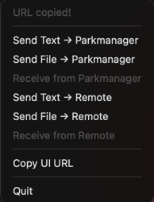
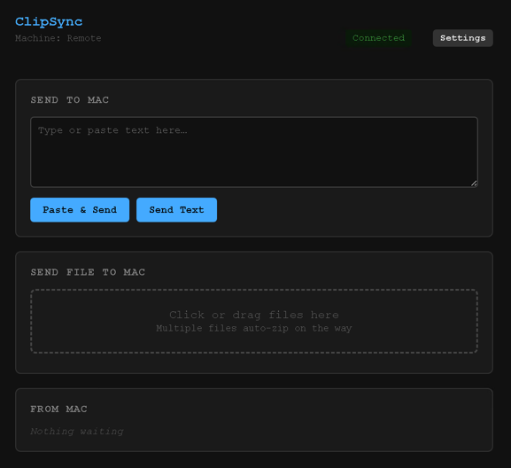

# Clipbridge

[](https://github.com/sven-s/clipbridge/actions/workflows/ci.yml)
[](https://github.com/sven-s/clipbridge/releases/latest)
[](LICENSE)

> Cross-machine clipboard relay for when your corporate RDP won't let you copy-paste.

You work on a Mac. You RDP into a customer's Windows machine through Horizon, AnyDesk, Jump Desktop, or similar — and the clipboard is one-way, text-only, or disabled entirely. Sending text and files back and forth becomes "email yourself" hell. Clipbridge fixes that.

Common offenders:

- **Omnissa / VMware Horizon** — admins routinely disable clipboard back to the client
- **Jump Desktop (Fluid protocol)** — fast, but the Fluid clipboard is **text-only**; files don't cross
- **AnyDesk / TeamViewer corporate policies** — often locked to one direction
- **Browser-based RDP / Citrix HTML5** — no clipboard support at all

Clipbridge runs as a menu bar app on your Mac and serves a small web UI to any number of remote Windows machines through a public tunnel — **Tailscale Funnel** by default, or **Cloudflare Tunnel** on your own domain when corporate proxies block `*.ts.net`. No installer on the Windows side — open a browser, paste a URL, done.

---

## Why this exists

Corporate Windows environments are hostile to ad-hoc tooling:

- **Clipboard disabled in RDP** — the original problem
- **No admin rights** — can't install Tailscale, can't add AV exclusions, can't run unsigned exes
- **Zscaler / SSL inspection** — exotic domains get blocked, `.exe` downloads get quarantined
- **Symantec / Defender heuristics** — unsigned Go binaries get false-positive flagged
- **Unknown firewall rules** — random ports are gambling

The web-UI approach sidesteps every one of those: nothing to install, plain HTTPS, no `.exe` to scan.

The one thing it can't sidestep is a proxy that blocks the *domain* you arrive on. Tailscale's `*.ts.net` is a frequent casualty — it lands in "Dynamic DNS" or "Uncategorized" and gets killed at the TLS handshake. That's why Clipbridge also supports fronting the same server with a **domain you own**, which corporate filters generally leave alone. See [Transports](#transports).

---

## Features

- 📋 **Bidirectional clipboard** — text and files, in both directions
- 🖥️ **Multi-machine** — register any number of Windows boxes, each gets its own slot in the menu bar
- 📂 **Large files** — streams 3 GB+ files both ways, no in-memory buffering, resumable downloads via HTTP Range, chunked uploads with per-chunk retry
- 🔒 **Shared-secret auth** — bearer token on every request
- 🌐 **Two transports** — Tailscale Funnel out of the box, or Cloudflare Tunnel on your own domain when `*.ts.net` is blocked. Either way: real cert, no port-forwarding, no router config
- 🪶 **Zero install on Windows** — just a browser bookmark

---

## How it looks

**Mac menu bar** — per-machine send / receive items, alphabetically sorted:



**Browser UI on Windows** — paste text, drop files, see incoming:



*(Screenshots — drop your own into `docs/images/` after first run)*

---

## Quick start

### Prerequisites

- macOS 10.13+ (Universal binary — runs natively on both **Apple Silicon** and **Intel** Macs)
- A transport, either:
  - a [Tailscale](https://tailscale.com) account with **Funnel enabled** in the admin console, plus the Tailscale CLI installed and logged in on your Mac — *or*
  - a domain on [Cloudflare](https://dash.cloudflare.com) and `cloudflared` (see [Transports](#transports))

### Install

**Homebrew (recommended):**

```bash
brew install --cask sven-s/tap/clipbridge
```

**Manual:**

1. Download the latest `Clipbridge-*.dmg` from the [Releases](https://github.com/sven-s/clipbridge/releases/latest) page (or build it yourself — see below)
2. Open the DMG, drag **Clipbridge.app** to **Applications**
3. The .dmg is **not code-signed** — on first launch right-click → **Open** to bypass Gatekeeper. macOS remembers your choice afterward.

**Then:**

1. Launch Clipbridge from Applications — a blue dot appears in your menu bar
2. The app automatically runs `tailscale funnel --bg 8457` and detects your tailnet hostname
3. Click the menu bar icon → **Copy UI URL**

### On every Windows machine

1. Paste the copied URL into a browser (Edge, Chrome, whatever)
2. Enter a name for the machine (e.g. `OFFICE-PC`)
3. Save & Connect — you're live

Now the Mac menu bar shows `Send Text → OFFICE-PC` / `Send File → OFFICE-PC` / `Receive from OFFICE-PC`.

---

## Transports

Clipbridge always serves plain HTTP on `127.0.0.1:8457`. Something in front of it terminates TLS and makes it reachable. Two options:

|                     | Tailscale Funnel                     | Cloudflare Tunnel                       |
| ------------------- | ------------------------------------ | --------------------------------------- |
| Setup               | automatic, zero config               | ~5 minutes, needs a domain              |
| Hostname            | `*.ts.net` (Tailscale's)             | yours, e.g. `clip.example.com`          |
| Survives corporate proxies | ⚠️ often blocked              | ✅ usually fine                          |
| Upload size limit   | none                                 | none — chunked past the 100 MB cap      |
| Download size limit | none                                 | none                                    |
| Throughput          | DERP-relayed, modest                 | Cloudflare edge, better                 |

Start with Funnel. If the browser on the remote machine shows `ERR_CONNECTION_CLOSED` — TCP connects, TLS never completes — the proxy is blocking `*.ts.net` and no amount of Tailscale config will fix it. Switch to Cloudflare.

> **Testing gotcha:** don't test Funnel from the host Mac. MagicDNS resolves your `*.ts.net` name to the tailnet IP, so it returns `200` while the public path is dead. Test from a machine that is neither on your tailnet nor behind the corporate proxy — a phone on cellular works.

### Cloudflare Tunnel setup

Requires a domain whose nameservers point at Cloudflare.

```bash
brew install cloudflared
cloudflared tunnel login                              # browser: pick your zone
cloudflared tunnel create clipbridge
cloudflared tunnel route dns clipbridge clip.example.com
```

Write `~/.cloudflared/config.yml` (the `create` step prints your tunnel UUID):

```yaml
tunnel: <TUNNEL-UUID>
credentials-file: /Users/YOU/.cloudflared/<TUNNEL-UUID>.json

originRequest:
  connectTimeout: 30s
  noHappyEyeballs: true

ingress:
  - hostname: clip.example.com
    service: http://127.0.0.1:8457
  - service: http_status:404
```

Verify, then run it:

```bash
cloudflared tunnel ingress validate
cloudflared tunnel run clipbridge
```

To keep it running across reboots, install a LaunchAgent at
`~/Library/LaunchAgents/de.example.clipbridge-tunnel.plist` with `RunAtLoad` and
`KeepAlive` set, invoking:

```
/opt/homebrew/bin/cloudflared --config /Users/YOU/.cloudflared/config.yml --no-autoupdate tunnel run clipbridge
```

```bash
launchctl bootstrap gui/$(id -u) ~/Library/LaunchAgents/de.example.clipbridge-tunnel.plist
```

Finally, point Clipbridge at it — add `public_url` to `~/.clipbridge/config.json` and restart the app:

```json
{
  "secret": "…",
  "server_port": 8457,
  "public_url": "https://clip.example.com"
}
```

With `public_url` set, Clipbridge skips Tailscale setup entirely and **Copy UI URL** hands out your own hostname.

---

## How it works

```
┌───────────────┐         ┌────────────────────┐         ┌──────────────────┐
│   Mac menu    │  HTTP   │  Tailscale Funnel  │  HTTPS  │  Windows browser │
│   bar app     │←───────→│         or         │←───────→│  (web UI)        │
│   (Go)        │  :8457  │  Cloudflare Tunnel │   443   │                  │
└───────────────┘         └────────────────────┘         └──────────────────┘
        ▲                   terminates TLS,
        │                   forwards plain HTTP
        │ Local clipboard (osascript / pbcopy)
```

- The Mac process hosts a Go HTTP server on `localhost:8457` — always plain HTTP
- The tunnel in front publishes it under a real cert; the Go server never sees TLS
- Each Windows browser polls every 3 s using the shared secret
- Files stream through; nothing is buffered in RAM

See [docs/architecture.md](docs/architecture.md) for the deep dive.

---

## Building from source

```bash
git clone https://github.com/YOUR-USERNAME/clipbridge
cd clipbridge
make dmg          # builds binary → .app → .dmg in ./build/
open build/Clipbridge.dmg
```

Available targets:

| Target  | What it does                              |
| ------- | ----------------------------------------- |
| `make`  | full pipeline → `build/Clipbridge.dmg`      |
| `build` | just the binary at `build/clipbridge-mac`   |
| `app`   | `.app` bundle at `build/Clipbridge.app`     |
| `dmg`   | distributable `.dmg`                      |
| `icon`  | regenerate `assets/icon.icns`             |
| `run`   | build & run from terminal                 |
| `clean` | nuke everything in `build/` and `assets/` |

---

## Project structure

```
clipbridge/
├── README.md           you are here
├── LICENSE             MIT
├── Makefile
├── go.mod
├── docs/               extended documentation
│   ├── architecture.md
│   └── security.md
├── assets/             generated icons (gitignored)
├── scripts/
│   ├── gen-icon.go     generates app icon
│   └── Info.plist      .app bundle metadata
└── src/
    ├── cmd/mac/        menu bar app entry point
    └── internal/
        ├── clip/       macOS clipboard (osascript)
        ├── config/     config + secret persistence
        └── server/     HTTP server + embedded web UI
```

---

## Limitations

- **One-Mac-many-Windows** by design — the Mac is the server. If you need many-to-many, this isn't it.
- **Tailscale Funnel bandwidth** — Funnel routes through Tailscale's DERP relays and is not optimized for high-throughput. 3 GB files work but expect minutes.
- **`*.ts.net` is blocked in many corporate networks** — the symptom is `ERR_CONNECTION_CLOSED` before any HTTP happens. Not fixable from your side; use the Cloudflare transport.
- **Cloudflare's 100 MB request cap is worked around, not inherited** — the web UI slices uploads into 64 MiB chunks and the server reassembles them, so there is no practical size limit in either direction. Chunks retry individually, so one dropped slice doesn't restart a multi-GB transfer.
- **Zscaler "scan-and-burst"** — corporate proxies often buffer the entire download before releasing it, so the browser shows `0 B/s` for a long time then dumps the whole file at once. This is the proxy's behavior, not a bug.
- **macOS only** for the host app. Linux/Windows host support is a future maybe — Windows clipboard handling on Linux/Windows hosts is messy enough that I haven't bothered.

---

## Security

- All traffic is HTTPS — Tailscale Funnel's Let's Encrypt cert, or Cloudflare's edge cert. Note that with Cloudflare, Cloudflare terminates TLS and can see plaintext; with Funnel, it's Tailscale. Pick whichever you'd rather trust.
- Every API call requires `Authorization: Bearer <secret>`
- File downloads accept the secret as `?auth=` (so browsers can use `<a download>`)
- The shared secret lives in `~/.clipbridge/config.json` (mode `0600`)
- Files in transit are stored as `~/.clipbridge/slots/{to-NAME,from-NAME}.{data,meta}`; the data is plain — wipe the slots dir if it concerns you

See [docs/security.md](docs/security.md) for the threat model.

---

## License

MIT — see [LICENSE](LICENSE).
